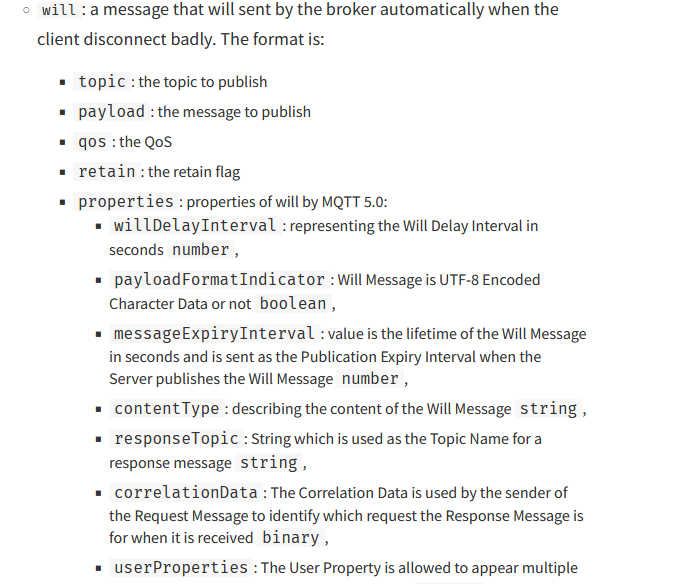

As discussed in the Overview connect method is used to:

- Create a client class
- Connect to a broker

The method is called as follows:

```js
var client = mqtt.connect(url,options)
```

and when called it connects to an MQTT broker and returns a client class.

e.g.

```js
var client = mqtt.connect("mqtt://192.168.1.157",options)
```

Usually they are many options that need to be passed to the method ,and so the options is usually created as a JavaScript object.

For example.To use user name and password authentication and a clean session use the following options.

```js
options={
clientId:"mqttjs01",
protocolVersion:4, //use 5 for mqttv5
username:"steve",
password:"password",
clean:true};
```

The **MQTT protocol** acknowledges a connection with the `CONNACK` message.

This raises the `on_connect` event in the client which can be examined by creating a listener as follows:

```js
client.on("connect",function(){	
console.log("connected");
```

The listener waits for the `connect` event and calls a callback function; which in the example above simply prints a message when the client connects.

The on_connect event also sets a flag called connected to true. You can access this flag using: client.connected.

# The URL
The url in the connect method contains either the IP address or domain name of the broker. It is also prefixed with a protocol in the example below it is MQTT

```js
var client = mqtt.connect("mqtt://192.168.1.157",options)
```

If we connect using MQTT+SSL the the protocol prefix is mqtts.
we have also the prefixes ws (websosckets) and wss (websockets+SSL).

The connection port can also be passed as part of the URL e.g

```js
var client = mqtt.connect("mqtt://192.168.1.157:1883",options)
```

but is usually set as part of the options. The options setting overrides the URL setting if both are present.

## Options
There are many options that can be passed to the connect method and you can find them listed [here](https://www.npmjs.com/package/mqtt).

In this tutorial I want to cover some of the most important and common ones that you need to be aware of.

## ClientId
Remember each client needs its own unique ID. There it is usual to generate a random one with a known prefix.

The prefix can be used in ACL( access control lists) so it is good practise to use one even though you may not be using ACLs at the moment.

The code I use looks like this:

```js
let r = Math.floor(Math.random() * 10000); 
let clientId= "mqttjs-"+r,
```

## Protocol Version
This is set in the connection packet and you should ensure that you set it correctly. It currently defaults to MQTTv3.1.1 (protocolVersion:4). For MQTTv5 use protocolVersion:5

## Setting the Last Will Message
The last will message is part of the connection packet. The will message has been expanded in MQTTv5. The following screenshot shows all of the possible settings but the properties attributes are only available in MQTT v5.



## Will settings Example
The connection options will look something like this

```js
let r = Math.floor(Math.random() * 10000);
var options={
	clientId:"mqttjs-will-"+r,
	port:1883,
    will:{topic:"connected",payload:"offline"}
}
```

## MQTT v5 Properties

When using MQTTv5 you can send additional information to the broker to control the connection.

It is possible to limit the number of topic aliases,limit the message size sent to the client amongst other things. All available options are in the [documentation](https://www.npmjs.com/package/mqtt).

You use as follows:

```js
let r = Math.floor(Math.random() * 10000);
var options={
    protocolVersion:5,
	clientId:"mqttjs-"+r,
	properties:{maximumPacketSize:1000}

    }
```

# Connecting Using SSL
To connect using SSL we need a CA certificate. If you are unfamiliar with certificates then please see Mosquitto MQTT Broker SSL Configuration Using Own Certificates.

We need to read the CA certificate from a file so we start with

```js
const fs = require('fs');
var caFile = fs.readFileSync("certs/ca-pi2.crt");
```

Now for the connection options we use something like that below:

```js
var options ={
  clientId: 'ssl-test',
  port: 8883,
  //rejectUnauthorized: false,
  ca: caFile
};
```

The `rejectUnauthorized` option is useful for troubleshooting and is used when the common name on the certificate doesn’t match the name used to access the broker over the tCP/IP connection.

I.e you used the domain name on the certificate but are connecting using the IP address.

You should also note the port as SSL,ws and wss use different ports.

The connect call looks like this:

```js
var client = mqtt.connect("mqtts://pi2.home", options);
```

## Websocket Connections

To connect using websockets we use:

```js
var client = mqtt.connect("ws://pi2.home", options);
```

and for websockets over SSL we use.

```js
var client = mqtt.connect("wsss://pi2.home", options);
```

The certificate configurations is the same as shown previously with mqtts.

## Connection to Multiple Brokers

You need to create a client for each connection. The code below illustrates this:

```js
var topic="testtopic";
//options for first connection
let r = Math.floor(Math.random() * 10000);
var options1={
	clientId:"mqttjs-"+r,
	port:1883}

//options for seconds connection
r = Math.floor(Math.random() * 10000);
var options2={
	clientId:"mqttjs-"+r,
	port:1884}

//now we can connect
var client  = mqtt.connect("mqtt://192.168.1.23",options1);
var client2  = mqtt.connect("mqtt://192.168.1.23",options2);
You should note that you will also need callback functions for each client.
```

Notes:

Creating a new Client using the `mqtt.Client(streamBuilder, options)` option should be possible, but I didn’t get it to work and couldn’t find any examples on the Internet. It is something I will keep trying to do.
In addition it should be possible to create a new client using the connect call but not connect to the broker. The documentation shows this:

> manualConnect: prevents the constructor to call connect. In this case after the mqtt.connect is called you should call client.connect manually.

I couldn’t get this to work and I couldn’t find the option in the client code. Again something I need to research further.

# Common Questions and Answers
**Q1: Can a Client connect to multiple brokers?**
- A1: No you need to create a new client for each connection.

**Q2: Can a client publish and subscribe?**
- A2; Yes

**Q3: Will the client automatically reconnect if the connection fails?**
- A3: Yes that is the default behaviour.

**Q4: I’m using NQTTv5 properties but they don’t appear to work?**
- A4: You probably have forgot to set the protocol version in the connect packer.

**Q5: My client keeps connecting and disconnecting what is the reason?**
- A5: You are probably using the same clientId as another client. This happens a lot when testing as many test script hard code the clientId.