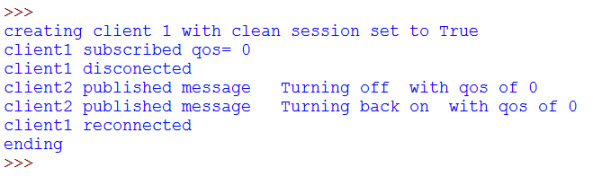
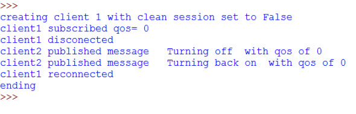
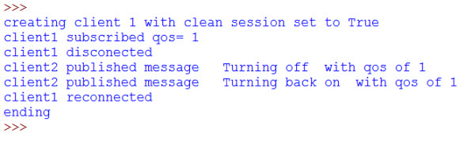
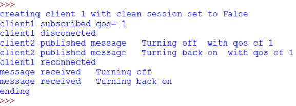
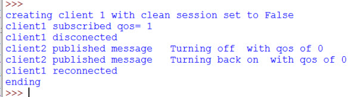
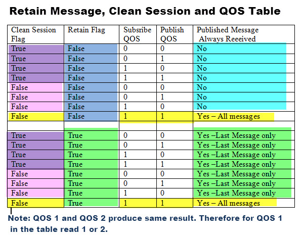

When a client connects to a broker it can connect using either

- a **non persistent connection** (clean session) or
- a persistent connection.

With **a non persistent connection** the broker **doesn’t store** any subscription information or undelivered messages for the client.

This mode is ideal when the client **only publishes** messages.

It can also connect as a **durable client** using a **persistent connection**

In this mode the broker **will store** subscription information, and undelivered messages for the client.

> In order for the broker to store session information for a client a **client id** must be used.

**Note:** Messages that have been **delivered to the client** are **deleted** from the broker. They are not stored like email messages are stored.

When a client connects to broker it uses a flag (**clean_session** flag) to indicate whether or not a **persistent connection** is required.

> However it is important to realise that not all messages will be stored for delivery, as the **quality of service**, of the subscriber and publisher has an effect.

In this example we look at the effects of the **clean_session** flag and of the quality of service settings on message delivery.

# Example Outline and Objectives

In this Example I will be using a Python script that creates **two client connections**.

One connection **subscribes to a topic** and the other connection **publishes on that topic**.

The objective is to see what happens to published messages when a subscriber is disconnected for any reason ,and how the `clean_session` flag, and **QOS** settings affect message delivery.

**Basic Process**

1. Initialise the client with clean_session flag set appropriately
2. Subscribe to a topic with QOS set
3. Disconnect.
4. Publish to the topic that the client subscribed to with QOS set.
5. Reconnect client
6. Make note of any messages received

# Python Client Configuration

The clean session flag is set in the client constructor which takes 4 **optional parameters**. The default values are shown below:

```py
Client(client_id=””, clean_session=True, userdata=None, protocol=MQTTv311, transport=”tcp”)
```

in your script create a client instance using:

```py
client= paho.Client("Python1",False) #create client object persistent connection
```

or
```
client= paho.Client("Python1",True) #create client object clean seesion
```

## Test 1

- clean_session =True,
- publish and subscribe default QOS  (quality of service) of 0

**Expected result**: No messages received as the broker shouldn’t store them.

**Actual Result**; No messages received when reconnected as the broker didn’t store them.

Screen shots:




## Test 2

- clean_session =False,
- publish and subscribe default QOS (quality of service) of 0

**Expected result**: Messages to be received.

**Actual Result**: No messages received when reconnected

**Comment** It is important to realise that not only do we need to set the clean_session flag to False, but we also need to publish and subscribe with a QOS of 1 or above.

However the subscription information is remembered by the broker, and so the client doesn’t need to subscribe again.

Screen shots:



## Test 3

- clean_session =True,
- publish and subscribe qos (quality of service) = 1

**Expected result**: No messages received when reconnected..

**Actual Result**: No messages received when reconnected as the clean_session flag was true.

Screen shots



## Test 4

- clean_session =False,
- publish and subscribe qos (quality of service) = 1

**Expected result**: Messages to be received when reconnected.
**Actual Result**: Messages received.when reconnected

Comment-Clean session flag is false and QOS on publish and subscribe are greater than 0.



## Test 5

- clean_session =False,
- publish QOS (quality of service) =0 and subscribe QOS(quality of service) = 1

**Expected result**: ?
**Actual Result**: No Messages received when reconnected

Comment-Clean session flag is false but QOS on publish isn’t>0



The table below is a summary showing how QOS, cleaned,session flag, and retained message flag affects what messages are received.




Demo Script


# Clean Sessions and Client Id
With persistent connections the connection details are stored against the client id and so when using persistent connections (clean session False) you cannot use a random client Id.

# Common Questions and Answers
**Q: How many messages will the broker store?**
- A: This is a broker setting. The mosquitto broker defaults to 100 – Setting is max_queued_messages count

**Q: How do I reset the client connection to be non-Persistent?**
- A: Connect again will clean session set to True

# Summary

Although MQTT doesn’t store messages in the same fashion as services like email, it does, in certain circumstances, store them.

Whether or not they are stored depends on the **QOS** of both the publisher and the subscriber.

However once they have been received and acknowledged by the subscriber, the broker deletes them immediately, regardless of the Clean session and QOS settings.