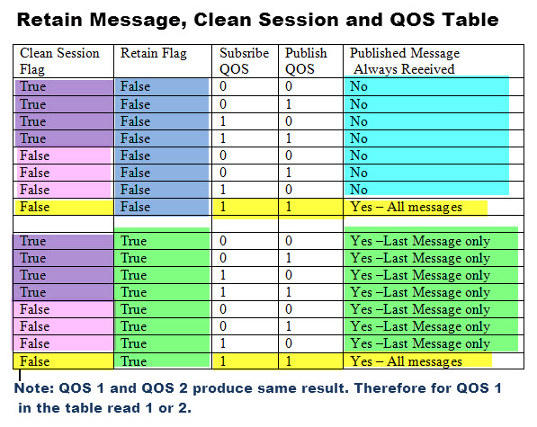

Normally if a publisher publishes a message to a topic, and no one is subscribed to that topic the message is simply **discarded** by the broker.

However the publisher can tell the broker to keep the last message on that topic by setting the **retained message flag**.

This can be very useful, as for example, if you have sensor publishing its status only when changed e.g. Door sensor. What happens if a new subscriber subscribes to this status?

Without retained messages the subscriber would have to wait for the status to change before it received a message.

However with the retained message the subscriber would see the current state of the sensor.

What is important to understand is that **only one message** is retained **per topic**.

The next message published on that topic **replaces** the **last retained** message for that topic.

# MQTT Retained Messages Example Overview

In this tutorial We will use a Python script to publish and subscribe to messages.

We will then examine **how retained messages work** with various **flag** and **QOS settings**.

> The important thing to note is that we will publish the messages before the client subscribes.

You should also note that I use **clean sessions** to avoid confusion.

If you don’t use clean sessions then you might see messages that have **been stored** but **not retained**!

The basic process is this:

1. Publish message on a topic with **retained message flag** not set, and set
2. Subscribe to message on topic
3. Monitor messages received and analyse results

We will also look at publishing multiple messages and how to **remove or delete a retained message**.

Referring to the screen shot below:

**Example 1** – Retain message flag **not set** and the new subscriber doesn’t get the message i.e no message received.

**Example 2** - Retain message **flag set** and the new subscriber gets the last message as indicated by the message received message.

**Example 3** – Retain message **flag set** and we publish several messages OFF,OFF2,OFF3. However the new subscriber only gets the last message OFF3.


## QOS Settings and Retained Messages and Deleting Retained Messages

The screen shot below shows 4 connection examples to demonstrate QOS effects, and then how we **delete retained messages**.

**Example 1**: We check if the QOS settings have any effect by setting the **QOS** to 0 . We see that the retained message is still received and the QOS of the published message has no effect..

**Example 2**: Now we try to **delete the retained message** by setting the retained message flag to **False**. However we notice that he message is **still retained**.

**Example 3**: Now we set the message to **blank** but keep the retained message flag as False. Again the message is still retained.

**Example 4:** Lastly we set the message to **blank** and the **retain flag** to `true` which clears the retained message.


The table below is a summary showing how QOS, the clean session flag, and retained message flag affects what messages are received by a new subscriber to a topic.



> Note: Some aspects of how the retain flag is handled is broker implementation dependent.

# Python Code
The code to publish with retained flag set is:

```py
client.publish(“bulb1”,”test message “,qos=0,retain=True)
```

where:

```py
topic=bulb
nessage =test mesage
QOS=0
Reatained message Flag=True
```

# Detecting a Retained Message

When you subscribe to a topic that has a retained message that message will be delivered to your client.

The client can detect that is a retained messages by examining the **message.retain flag** in the **on message callback** as shown in the code snippet below:

```py
def on_message(client, userdata, message):
    print("message received  ",str(message.payload.decode("utf-8")),\
          "topic",message.topic,"retained ",message.retain)
    if message.retain==1:
        print("This is a retained message")
```

# Scripts
I have created a Python script that will clear the retained messages on a group of topics, and also report on the topics that have retained messages.

download


# Common Questions and Answers

**Q: How do I remove or delete a retained message?**
- A: Publish a blank message with the retain flag set to true which clears the retained message.

**Q: Does the QOS of a message have any effect on retained messages?**
- A: No it doesn’t.

**Q: How do I know If a message has been retained?**
- A: You only know when you subscribe to the topic and examine the retained flag.
- Q: If I subscribe to a topic and receive the retained message does the broker/server then delete that message?
- A: No. It is retained and will be set to new clients when they subscribe.
- Q: How do I delete or clear all retained messages on Fubo?
- A: If you’re not using the persistent database then the easiest way is to stop and restart mosquitto. Otherwise you will need to subscribe to all topics to check and clear the retained messages. You can use my Python script to do this. However this is not recommended on a busy broker.

# When to Use Retained Messages

Generally you will publish a message with the retained flag set when the message contains persistent data.

For example a sensor could publish information about itself like firmware version number,IP address, Current state.

This information is unlikely to change and so you only need to publish it once using the retain flag and any new clients can retrieve that information.

# Using Retained Messages as A Data Store

I have seen applications were the retained messages have been used as a data store.

If you take a look at my tutorial on home assistant and MQTT you will see this in action.

Although it is possible you should be aware of the consequences i.e what happens if someone removes the retained messages as part of a clean up?

# Retained Message Format Proposal

Because retained messages are being used as a semi persistent/persistent data store then it would be useful in my option to publish extra information with the actual message payload.

As minimum you should publish a timestamp and a deletion allowed flag.So we would have

```json
{“payload”:payload,”timestamp”:timestamp,”delete_allowed”:True/False}
```

Deletion utilities could check these and delete very stale messages but not ones that shouldn’t be deleted.

# Summary

The retained message feature is useful feature for keeping the last state of an object, and is especially useful when the state doesn’t change frequently.

Quality of service settings don’t impact retained messages.